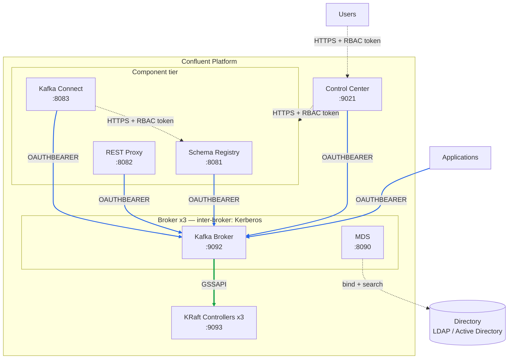
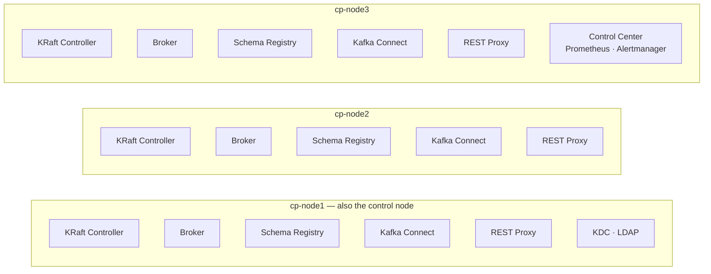
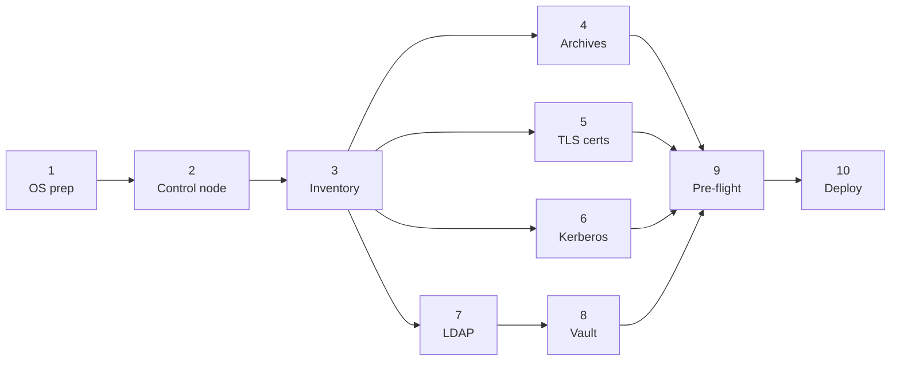

# Confluent Platform 8.3 — Secure KRaft Lab

A reference deployment repository that brings up a fully secured, 3-node
Confluent Platform cluster with **a single Ansible run**. Software is installed
from Confluent's archives rather than a package repository, so the target hosts
need no internet access at all.

| Layer | Technology |
|---|---|
| Metadata | KRaft (isolated mode) — no ZooKeeper |
| Encryption | TLS with a self-managed Root CA |
| Server-to-server authentication | Kerberos / SASL_GSSAPI |
| Client authentication | SASL/OAUTHBEARER (RBAC token) |
| Authorization | Confluent RBAC + MDS + LDAP |
| Software distribution | Confluent archives (tarball), shipped from the control node |

**Components deployed:** KRaft Controller, Kafka Broker, Schema Registry,
Kafka Connect, REST Proxy, Control Center Next Gen.

> **About secrets:** in this base installation passwords are encrypted at rest
> in Ansible Vault, but they are written **in plaintext** into the `.properties`
> files on the target machines. If that is unacceptable for your environment,
> apply one of the add-ons under **[`secrets/`](secrets/)** *after* the base
> installation completes — no reinstall required, they layer on top of a
> running cluster.

---

## Table of contents

1. [Architecture](#1-architecture)
2. [Capacity planning](#2-capacity-planning)
3. [Installation](#3-installation) — steps 1 through 10
4. [Verification](#4-verification)
5. [UI access and RBAC](#5-ui-access-and-rbac)
6. [Behaviours worth knowing](#6-behaviours-worth-knowing)
7. [Out of scope](#7-out-of-scope)

---

## 1. Architecture



<sub>**——** OAUTHBEARER (client) · **==** Kerberos/GSSAPI (server-to-server) ·
**- -** HTTPS + RBAC token (component-to-component)</sub>

Three authentication mechanisms run simultaneously and are **independent of
one another**:

- **Server ↔ server** (broker↔broker, broker↔controller): Kerberos/GSSAPI
- **Client ↔ server**: OAUTHBEARER — short-lived token issued by MDS
- **Component ↔ component** (Connect→SR, C3→components): HTTPS + RBAC token

### Component placement



Schema Registry, Kafka Connect and REST Proxy run on all three nodes so that
each forms a real cluster — SR elects a leader, Connect workers join one
distributed group, REST Proxy scales horizontally. Control Center is a single
instance.

> `auth_mode: ldap` switches **only** the client-facing listener to
> OAUTHBEARER. The inter-broker and controller listeners are separate blocks
> driven by `sasl_protocol` / `kafka_controller_sasl_protocol`. Missing this
> distinction is a common source of "why didn't Kerberos engage?" confusion.

### Ports in use

Make sure these are reachable between nodes before deploying:

| Port | Component | Direction |
|---|---|---|
| 9092 | Broker (client listener) | all nodes ↔ clients |
| 9093 | KRaft controller | node-to-node |
| 8090 | MDS | all nodes ↔ clients |
| 8081 | Schema Registry | all nodes |
| 8082 | REST Proxy | clients |
| 8083 | Kafka Connect | node-to-node (worker coordination) |
| 9021 | Control Center | users |
| 9090 / 9195 / 9196 | Prometheus / Alertmanager (web + gossip) | C3 node |
| 88 (TCP) | Kerberos KDC | all nodes → `cp_infra_host` |
| 1389 | LDAP | all nodes → `cp_infra_host` |

---

## 2. Capacity planning

Measured resident memory on an idle cluster:

| Component | Heap setting | Actual RSS |
|---|---|---|
| KRaft Controller | 1 GB | ~1.3 GB |
| Broker | 3 GB | ~3.5 GB |
| Schema Registry | 768 MB | ~1.0 GB |
| Kafka Connect | 1 GB | ~1.1 GB |
| REST Proxy | 512 MB | ~1.0 GB |
| Control Center | 3 GB | ~1.2 GB (idle) |

In the default layout every node runs Controller + Broker + SR + Connect +
REST (**~8 GB**); `cp-node3` additionally hosts Control Center (**~9 GB**).

**Recommendation:** at least **12 GB RAM** per node, **16 GB** on the node
running Control Center. If memory is tight, give Control Center its own node.

Disk: at least 50 GB per broker (lab scale). CPU: 4 vCPU per node.

---

## 3. Installation

Steps 4 through 7 are independent of one another and can be done in parallel:



### Step 1 — Operating system preparation (on all three nodes)

Verified on RHEL 9 and derivatives (Rocky, Alma).

**1a. Set hostnames.** The `inventory_hostname` values must match the
certificate and keytab filenames, so keep them consistent:

```bash
sudo hostnamectl set-hostname cp-node1.lab.local   # use each node's own name
```

**1b. Name resolution.** Without DNS, add to `/etc/hosts` on all three nodes:

```bash
sudo tee -a /etc/hosts <<'EOF'
10.0.0.1  cp-node1.lab.local  cp-node1
10.0.0.2  cp-node2.lab.local  cp-node2
10.0.0.3  cp-node3.lab.local  cp-node3
EOF
```

Both the short name **and** the FQDN are required — Kerberos uses the FQDN,
the Ansible inventory uses the short name.

**1c. Verify:**

```bash
for n in cp-node1 cp-node2 cp-node3; do ping -c1 -W1 $n >/dev/null && echo "$n OK"; done
```

**1d. Clock synchronisation.** Kerberos does not tolerate clock drift between
hosts (default skew allowance: 5 minutes). Skipping this surfaces later as
`Clock skew too great`:

```bash
sudo systemctl enable --now chronyd
chronyc tracking | grep "System time"
```

### Step 2 — Control node preparation

The control node may be one of the three cluster nodes (`cp-node1` here).

**2a. Ansible and Python:**

```bash
sudo dnf install -y ansible-core python3.11 python3.11-pip git podman
```

**2b. The cp-ansible collection:**

```bash
ansible-galaxy collection install confluent.platform:8.3.0
ansible-galaxy collection list | grep confluent.platform
```

In an air-gapped environment, download it on a connected machine and transfer:

```bash
# on a machine with internet access:
ansible-galaxy collection download confluent.platform:8.3.0 -p /tmp/cpcoll
# after copying the tarball to the control node:
ansible-galaxy collection install /path/to/confluent-platform-8.3.0.tar.gz
```

**2c. `bcrypt`** — required to hash the Prometheus/Alertmanager passwords for
Control Center. It is needed **on the control node**, not on the managed hosts:

```bash
ansible-playbook --version | grep "python version"
# install into exactly that interpreter, e.g.:
/usr/bin/python3.11 -m pip install bcrypt
```

> A generic `pip3 install bcrypt` **may not be enough** — it must land in the
> interpreter `ansible-playbook` actually uses. If it is missing, the Control
> Center deployment stops with `ModuleNotFoundError: No module named 'bcrypt'`.

**2d. Place the repository.** `cp_repo_dir` in `hosts.yml` must point here:

```bash
sudo mkdir -p /opt/confluent-platform-lab
sudo chown $USER:$USER /opt/confluent-platform-lab
git clone <REPO_URL> /opt/confluent-platform-lab
# or, if air-gapped: copy and extract a tarball instead
cd /opt/confluent-platform-lab
```

**2e. SSH access.** Passwordless SSH from the control node to the other two:

```bash
ssh-keygen -t ed25519 -f ~/.ssh/cp-node2.key -N ''
ssh-keygen -t ed25519 -f ~/.ssh/cp-node3.key -N ''
ssh-copy-id -i ~/.ssh/cp-node2.key.pub cloud-user@10.0.0.2
ssh-copy-id -i ~/.ssh/cp-node3.key.pub cloud-user@10.0.0.3
# verify (must not prompt for a password):
ssh -i ~/.ssh/cp-node2.key cloud-user@10.0.0.2 'hostname'
```

The user needs passwordless `sudo` (required by `ansible_become: true`).

### Step 3 — Configure the inventory

`ansible/hosts.yml` contains three blocks marked **"### CHANGE ME"**. Edit only
those.

**3a. Environment identity** (block 1/3):

```yaml
cp_domain: lab.local
cp_realm: LAB.LOCAL                       # the domain in UPPERCASE
cp_ldap_base: "dc=lab,dc=local"           # the domain as a DN
cp_cluster_name: cp-lab
cp_repo_dir: /opt/confluent-platform-lab  # the path from step 2d
cp_infra_host: cp-node1
```

**3b. Nodes** (block 2/3) — real IPs and SSH key paths:

```yaml
  hosts:
    cp-node1:
      ansible_connection: local
    cp-node2:
      ansible_host: 10.0.0.2
      ansible_ssh_private_key_file: ~/.ssh/cp-node2.key
    cp-node3:
      ansible_host: 10.0.0.3
      ansible_ssh_private_key_file: ~/.ssh/cp-node3.key
```

**3c. Which node runs Control Center** (block 3/3) — at the end of the file.

**3d. Verify connectivity:**

```bash
cd ansible
ansible all -i hosts.yml -m ping
```

All three nodes must return `SUCCESS`. Do not proceed otherwise.

> **Expected here:** `ERROR! The vault password file ~/.vault_pass was not
> found`. `ansible.cfg` sets `vault_password_file`, and Ansible loads it for
> *every* command — even a `ping` that decrypts nothing. The real file is
> created in Step 8; to run this check now, a throwaway value is enough and
> gets overwritten later:
>
> ```bash
> echo dummy > ~/.vault_pass && chmod 600 ~/.vault_pass
> ```

### Step 4 — Confluent Platform archives

This repository installs from **tarballs**, not RPMs
(`installation_method: archive`). Nothing is installed from yum, and no
Confluent repository is configured on the nodes. The archives are fetched once
onto the control node; Ansible copies and expands them on every host.

**4a. Download both archives** into `packages/` on the control node:

```bash
cd /opt/confluent-platform-lab/packages

curl -LO https://packages.confluent.io/archive/8.3/confluent-8.3.0.tar.gz

curl -LO https://packages.confluent.io/confluent-control-center-next-gen/archive/confluent-control-center-next-gen-2.2.0.tar.gz
```

> **Two archives, two version numbers.** Control Center Next Gen is packaged
> separately and versioned independently — **2.2.0** for CP 8.3, not 8.3.0.
> Downloading only the first file lets the run get all the way to the Control
> Center role before it fails.

**4b. Verify what you downloaded** — a truncated or HTML-error-page download
surfaces much later as a confusing extraction failure:

```bash
ls -lh confluent-*.tar.gz
```

```bash
for f in confluent-*.tar.gz; do tar -tzf "$f" >/dev/null && echo "$f OK"; done
```

Both must print `OK`, and the platform archive should be on the order of a
gigabyte. If it is a few kilobytes you downloaded an error page.

**4c. Air-gapped?** Run the two `curl` commands on a connected machine and copy
the files into `packages/` — that is the only step needing internet. The nodes
themselves never reach out, because `confluent_archive_file_remote: false`
tells Ansible the tarball lives on the control node.

> Ansible ships the full archive to each host over SSH, so the first deploy
> moves roughly a gigabyte per node. This is normal and only happens once —
> the `creates:` guard on the extraction task skips hosts that already have it.

**4d. Prefer RPMs instead?** Set `installation_method: package` in
`hosts.yml`, drop the four `confluent_archive_*` variables, and let cp-ansible
configure Confluent's official repository (its default when no custom repo file
is given). With direct internet access that needs no repository file of your
own; verify signatures rather than disabling the check:

```bash
sudo tee /etc/yum.repos.d/confluent.repo <<'EOF'
[Confluent]
name=Confluent repository
baseurl=https://packages.confluent.io/rpm/8.3
gpgcheck=1
gpgkey=https://packages.confluent.io/rpm/8.3/archive.key
enabled=1
EOF
```

The two methods are mutually exclusive — pick one. Paths differ between them,
which matters when you go looking for configuration files:

| | `archive` (this repo) | `package` |
|---|---|---|
| Binaries | `/opt/confluent/confluent-8.3.0/bin` | `/usr/bin` |
| Configuration | `/opt/confluent/etc/kafka/` | `/etc/kafka/` |
| Plugin path base | expanded archive directory | `/usr/share` |

### Step 5 — TLS certificates

```bash
cd /opt/confluent-platform-lab/pki/scripts
./gen-root-ca.sh
./gen-host-cert.sh cp-node1 cp-node1.lab.local 10.0.0.1
./gen-host-cert.sh cp-node2 cp-node2.lab.local 10.0.0.2
./gen-host-cert.sh cp-node3 cp-node3.lab.local 10.0.0.3
```

Each invocation prints `OK` and the resulting SAN list.

> **If you will reach Control Center from a browser over a public IP**, pass
> that IP as the fourth argument:
> ```bash
> ./gen-host-cert.sh cp-node3 cp-node3.lab.local 10.0.0.3 203.0.113.10
> ```
> Connecting over an address that is absent from the SAN list makes Jetty
> return `HTTP ERROR 400 Invalid SNI`. It looks like a network or firewall
> problem but is purely a certificate-scope issue.

### Step 6 — Kerberos KDC and keytabs

**6a. Install the KDC** (on `cp_infra_host`):

```bash
sudo dnf install -y krb5-server krb5-workstation
sudo cp /opt/confluent-platform-lab/kerberos/kdc.conf.example \
        /var/kerberos/krb5kdc/kdc.conf
sudo cp /opt/confluent-platform-lab/kerberos/kadm5.acl.example \
        /var/kerberos/krb5kdc/kadm5.acl
# replace LAB.LOCAL with your own realm in both files
sudo sed -i 's/LAB\.LOCAL/<YOUR_REALM>/g' /var/kerberos/krb5kdc/{kdc.conf,kadm5.acl}
```

**6b. Create the database and start the services:**

```bash
sudo kdb5_util create -s -r LAB.LOCAL     # prompts for a master password; keep it
sudo systemctl enable --now krb5kdc kadmin
sudo systemctl is-active krb5kdc kadmin
```

**6c. Open the port** so the other nodes can reach the KDC:

```bash
sudo firewall-cmd --add-port=88/tcp --permanent && sudo firewall-cmd --reload
# verify from another node:
ssh cp-node2 'timeout 3 bash -c "</dev/tcp/cp-node1/88" && echo "KDC reachable"'
```

**6d. Create principals and keytabs.** One service principal per node, written
into **two** keytab files:

```bash
cd /opt/confluent-platform-lab
for N in cp-node1 cp-node2 cp-node3; do
  sudo kadmin.local -q "addprinc -randkey kafka/${N}.lab.local@LAB.LOCAL"
  sudo kadmin.local -q "ktadd -k /tmp/${N}-kafka_broker.keytab     kafka/${N}.lab.local@LAB.LOCAL"
  sudo kadmin.local -q "ktadd -k /tmp/${N}-kafka_controller.keytab kafka/${N}.lab.local@LAB.LOCAL"
done
sudo mv /tmp/cp-node*.keytab pki/keytabs/
sudo chown $USER:$USER pki/keytabs/*.keytab
chmod 640 pki/keytabs/*.keytab
```

**6e. Verify:**

```bash
klist -kt pki/keytabs/cp-node1-kafka_broker.keytab
ls -1 pki/keytabs/ | wc -l          # expect 6 files
```

> **Why the same principal in two keytabs?** The broker and controller roles
> expect separate keytab paths, but the GSSAPI service name must be `kafka` for
> both. Writing the same key into two files satisfies both requirements.
>
> **`ktadd` rotates the key.** The second call generates a new KVNO, which is
> why the two must run **back to back**. If you later regenerate only one
> keytab, the other becomes invalid and that role can no longer authenticate.
>
> cp-ansible's `kerberos` role does **not** create principals or keytabs — it
> only copies an existing keytab to the target and writes `krb5.conf`.

### Step 7 — Directory (LDAP)

A test OpenLDAP on `cp_infra_host` is sufficient for a lab. If you are using a
corporate AD/LDAP, skip this step and adjust the `ldap.*` settings in
`hosts.yml` to match your directory.

**7a. Start the container:**

```bash
cd /opt/confluent-platform-lab/compose
cp .env.example .env
# set LDAP_ADMIN_PASSWORD (and LDAP_DOMAIN if you changed cp_domain)

podman-compose --profile ldap up -d

# podman has no persistent daemon, so restart:always only survives a host
# reboot if this unit is enabled:
sudo systemctl enable --now podman-restart.service
podman ps --filter name=openldap
```

All supporting containers — directory, and later the optional secrets vault
and monitoring stack — live in one place: [`compose/`](compose/).

**7b. Load the directory skeleton and accounts.** Replace `dc=lab,dc=local` in
`bootstrap.ldif` with your own base DN first, then:

```bash
cd /opt/confluent-platform-lab
podman cp ldap/bootstrap.ldif openldap:/tmp/
podman exec openldap ldapadd -x -H ldap://localhost:389 \
  -D "cn=admin,dc=lab,dc=local" -w "<LDAP_ADMIN_PW>" -f /tmp/bootstrap.ldif
```

**7c. Generate and assign passwords:**

```bash
./ldap/set-passwords.sh "<LDAP_ADMIN_PW>"
cat ldap/generated-passwords.txt
```

**7d. Verify** that an account can actually bind:

```bash
podman exec openldap ldapwhoami -x -H ldap://localhost:389 \
  -D "uid=mds,ou=users,dc=lab,dc=local" -w '<MDS_PASSWORD>'
# expected: dn:uid=mds,ou=users,dc=lab,dc=local
```

> Run LDAP commands **from inside the container**. Under rootless podman the
> host-side port mapping (1389→389) does not behave as expected for
> `ldapsearch`/`ldapadd` and you will get `Can't contact LDAP server (-1)`.
> The brokers (JVM) connect through the host port without any problem — this
> only affects the command-line tools.

> **Production note:** `ldap-bind-user` in `bootstrap.ldif` is the account MDS
> uses to query the directory, and it should have **read-only** access. Do not
> use the directory administrator (`cn=admin`) for this — that identity ends up
> written into every broker's configuration file.

### Step 8 — Secrets (Ansible Vault)

```bash
cd /opt/confluent-platform-lab/ansible
cp vault.yml.example vault.yml
```

Copy the values from `ldap/generated-passwords.txt` into `vault.yml`, then:

```bash
ansible-vault encrypt vault.yml
echo '<vault-password>' > ~/.vault_pass && chmod 600 ~/.vault_pass
head -1 vault.yml     # should read $ANSIBLE_VAULT;1.1;AES256
shred -u ../ldap/generated-passwords.txt
```

### Step 9 — Pre-flight check

```bash
cd /opt/confluent-platform-lab/ansible
ansible-playbook -i hosts.yml -e @vault.yml confluent.platform.validate_hosts
```

This validates memory, disk, Python version, name resolution and package
reachability. Every failure here will also occur during the deployment — fix
them before moving on.

### Step 10 — Deploy

```bash
ansible-playbook -i hosts.yml -e @vault.yml confluent.platform.all
```

Expect roughly 15–25 minutes for a three-node cluster.

> **Do not use `--limit`.** The RBAC token-acquisition tasks delegate to
> `groups['kafka_broker'][0]`. If a limit excludes that node, the deployment
> fails with an error that gives no hint as to the real cause.

> **If the error message is censored:** cp-ansible runs many tasks with
> `no_log: true`, so the real failure shows up as `censored`. Re-run with:
> ```bash
> ansible-playbook -i hosts.yml -e @vault.yml -e mask_secrets=false confluent.platform.all
> ```

---

## 4. Verification

> For deeper, per-component testing — accessibility, functional, and
> resilience/failover tests, including a real leader-election kill test for
> Schema Registry — see **[`testing/`](testing/)**. This section covers the
> smoke test that confirms the installation itself succeeded.

**Services:**

```bash
ansible all -i hosts.yml -b -m shell -a \
  'systemctl is-active confluent-kcontroller confluent-server \
   confluent-schema-registry confluent-kafka-connect confluent-kafka-rest'
```

**TLS:**

```bash
openssl s_client -connect cp-node1:9092 -CAfile ../pki/ca/ca.crt </dev/null 2>&1 \
  | grep "Verify return code"      # 0 (ok)
```

**RBAC is active** — unauthenticated requests must be rejected:

```bash
curl -sk -o /dev/null -w "SR:   %{http_code}\n" https://cp-node1:8081/subjects
curl -sk -o /dev/null -w "REST: %{http_code}\n" https://cp-node1:8082/v3/clusters
# both 401
```

**Authenticated request:**

```bash
curl -sk -u mds:<MDS_PW> https://cp-node1:8082/v3/clusters | head -20
```

**Cluster registration** — components must be present in the MDS registry:

```bash
export CONFLUENT_PLATFORM_USERNAME=mds CONFLUENT_PLATFORM_PASSWORD='<MDS_PW>'
confluent login --url https://cp-node1:8090 \
  --certificate-authority-path ../pki/ca/ca.crt
confluent cluster list
```

You should see `cp-lab`, `cp-lab-schema-registry` and `cp-lab-connect`.

**End-to-end data flow** — produce through REST Proxy, then read straight from
the broker:

```bash
CID=$(confluent cluster list -o json | python3 -c \
  "import sys,json;print(json.load(sys.stdin)[0]['scope']['clusters']['kafka-cluster'])")

curl -sk -u mds:<MDS_PW> -X POST "https://cp-node1:8082/v3/clusters/$CID/topics" \
  -H "Content-Type: application/json" \
  -d '{"topic_name":"smoke-test","partitions_count":3,"replication_factor":3}'

curl -sk -u mds:<MDS_PW> -X POST \
  "https://cp-node1:8082/v3/clusters/$CID/topics/smoke-test/records" \
  -H "Content-Type: application/json" \
  -d '{"key":{"type":"STRING","data":"k1"},"value":{"type":"STRING","data":"hello"}}'
```

The response must carry a real `partition_id` and `offset`.

---

## 5. UI access and RBAC

Control Center: `https://cp-node3:9021`

If you log in and see **"All clusters (0)"**, that is not a bug — it is a
missing role binding. The MDS endpoint that populates Control Center's cluster
list consults **role bindings only**; membership in `super.users` grants
unlimited real access but is invisible to that lookup.

Grant an explicit binding to every identity that will use the UI:

```bash
CID=<kafka-cluster-id>

# Kafka cluster scope
confluent iam rbac role-binding create --principal User:mds \
  --role SystemAdmin --kafka-cluster "$CID"

# Schema Registry scope (separate!)
confluent iam rbac role-binding create --principal User:mds --role SystemAdmin \
  --kafka-cluster "$CID" --schema-registry-cluster schema-registry

# Connect scope (separate!)
confluent iam rbac role-binding create --principal User:mds --role SystemAdmin \
  --kafka-cluster "$CID" --connect-cluster connect-cluster
```

> Each component requires its **own scope**; `SystemAdmin` on the Kafka cluster
> does not carry over.
>
> The `--connect-cluster` value is **not** `kafka_connect_cluster_name` but
> `kafka_connect_group_id` (default `connect-cluster`). That is also the name
> Control Center displays.
>
> Next Gen has **no separate "Schema Registry" menu** — schemas live under
> **Topics → topic → Schema**.

---

## 6. Behaviours worth knowing

This section collects behaviours encountered during real deployments. **None
of them produce an error message.**

### Redeploy Control Center after adding a component

cp-ansible generates Control Center's configuration behind a condition that
tests whether a given group exists in the inventory — and that condition is
evaluated **when Control Center itself is deployed**. If you deployed C3 before
Kafka Connect, not a single Connect-related line was written into C3's
configuration file, and deploying Connect afterwards does not update it.

The symptom: Connect is `active`, appears in `confluent cluster list`, its role
bindings are in place — yet the UI shows **"No Connect Clusters Found"**.

This repository deploys everything in one pass, so the problem does not arise.
If you add a component later:

```bash
ansible-playbook -i hosts.yml -e @vault.yml confluent.platform.control_center_next_gen
```

To diagnose, query Control Center's own API rather than guessing from the UI:

```bash
curl -sk -H "Authorization: Bearer $TOKEN" https://cp-node3:9021/2.0/clusters/connect
```

An empty `[]` means C3 does not know about that component.

### Leaving `<component>_cluster_name` empty hides the component

`kafka_broker_cluster_name`, `schema_registry_cluster_name` and
`kafka_connect_cluster_name` all default to an **empty string** in cp-ansible,
and the MDS registration task is gated on `when: ..._cluster_name | length > 0`.
Leave them empty and the deployment finishes with `failed=0`, the component
never registers, and nothing warns you. All three are set in this repository.

**REST Proxy is the exception** — there is no `kafka_rest_cluster_name`
variable, it does not register with the MDS registry, and it has no Control
Center integration. When adding a new component, check the source rather than
assuming the pattern holds:

```bash
grep -n "<component>_cluster_name" roles/variables/defaults/main.yml
grep -n "<component>" roles/variables/vars/main.yml    # does it appear in the C3 blocks?
```

### Most components grant their own roles

cp-ansible creates these **automatically** during deployment — do not create
them by hand:

| Component | Automatic binding |
|---|---|
| Schema Registry | `SecurityAdmin` + `ClusterAdmin` + `ResourceOwner` (Group/Topic) |
| Kafka Connect | `SecurityAdmin` + `ResourceOwner` on 4 internal topics/group |
| REST Proxy | `ResourceOwner` on `_confluent-command` and `_confluent-monitoring` |
| Control Center | `SystemAdmin` (unconditional) |

What genuinely needs doing by hand: `DeveloperWrite` at cluster scope for
Connect (idempotent producer), and the visibility bindings in §5.

REST Proxy reaches Kafka as the **requesting user** (impersonation), not as its
own service account.

### Roles granted through a group may not show up in the UI

When a user receives a role through an LDAP group, authorization genuinely
works (`role-binding list` shows the binding, the broker permits access) — but
Control Center's cluster-visibility lookup may return empty. The JWT issued by
MDS carries no `groups` claim:

```json
{"jti":"...","iss":"Confluent","sub":"developer1","azp":"developer1"}
```

If your design relies on binding roles to groups, **test this in your own
environment**. Per-user bindings work without issue.

### Alertmanager uses two ports

A web/API port (`control_center_next_gen_dependency_alertmanager_port`) and a
cluster gossip port. The gossip port is **not configurable** through the
wrapper script and lands on web port + 1. The default 9093 collides with the
KRaft controller listener; moving it to 9094 makes it collide with its own
gossip port. This repository uses 9195. If you change it, verify both are free:

```bash
ss -tlnp | grep -E ':(9195|9196)'
```

### Certificate changes do not apply themselves

Refreshing the local PEM files and redeploying may not be enough: if the target
files already exist, cp-ansible can skip keystore/truststore regeneration, and
the "Certs were Updated - Trigger Restart" task can report `ok` without the
service actually restarting.

```bash
sudo rm -f /var/ssl/private/<component>.{crt,key,keystore.jks,truststore.jks}
# redeploy, then restart MANUALLY:
sudo systemctl restart <service>
```

Do not test immediately after a restart — the JVM may take a minute or two to
bind its listener, and "Connection refused" during that window is not a real
problem.

### Custom log paths need an SELinux label, not just a variable

Every component's application-log location is a real, independent variable
(`kafka_controller_log_dir`, `kafka_broker_log_dir`, `schema_registry_log_dir`,
`kafka_connect_log_dir`, `kafka_rest_log_dir`,
`control_center_next_gen_log_dir` — separate from `log.dirs`, the Kafka *data*
directory, see [`ansible/hosts.yml`](ansible/hosts.yml)). Pointing any of them
outside `/var/log` is enough to make Prometheus and Alertmanager fail to start
on an SELinux-enforcing host, with an error that looks unrelated to SELinux:

```
Failed to set up standard output: Permission denied
# systemctl status shows: (code=exited, status=209/STDOUT)
```

`/var/log/*` is auto-labeled `var_log_t` by the base policy; a path like
`/opt/confluent-logs/broker` inherits the generic `usr_t` type instead.
Prometheus and Alertmanager start through Confluent's own wrapper scripts,
which redirect stdout via systemd's `StandardOutput=append:<path>` — and
systemd (`init_t` domain) is blocked by the targeted policy from appending to
a non-`var_log_t` file. A manual `sudo -u <user> touch <path>` test from an
interactive SSH session will misleadingly succeed: that shell runs in a more
permissive context than systemd's own.

The other components (broker, controller, Schema Registry, Connect, REST
Proxy) write their own logs directly from the JVM via log4j2, a different code
path that this restriction does not affect — so a custom path can look like it
works everywhere, right up until you enable JMX monitoring.

Fix, once per new path, before deploying:

```bash
sudo semanage fcontext -a -t var_log_t "/opt/confluent-logs(/.*)?"
sudo restorecon -Rv /opt/confluent-logs
```

This adds a persistent policy rule — it survives reboots and relabeling, and
needs to be run on every host that uses the custom path.

### FileStreamSourceConnector needs an explicit plugin path

`org.apache.kafka.connect.file.FileStreamSourceConnector` looks like it should
be available on any Kafka Connect worker — it's often described as shipping
with Kafka core. On this package-based install it returns:

```
error_code: 400, "Failed to find any class that implements Connector and which
name matches FileStreamSourceConnector..."
```

The JAR is genuinely there — under `share/filestream-connectors/` inside the
expanded archive (in an RPM install it is `/usr/share/filestream-connectors`,
owned by `confluent-server`). It is just not on Connect's `plugin.path`.
cp-ansible's default is `share/java/connect_plugins`, which is empty until you
install a connector into it; the file connectors ship in their own separate
directory.

This is deliberate isolation, not an oversight: file connectors can read and
write arbitrary paths on the host the worker runs on, so packaging them
outside the default plugin path keeps them opt-in. Add the directory
explicitly if you want them (see `kafka_connect_plugins_path` in
[`ansible/hosts.yml`](ansible/hosts.yml)) rather than assuming any bundled
connector is loaded by default.

### If you cannot find a setting in cp-ansible, do not conclude it is absent

Some configuration keys never appear literally in YAML or Jinja; they are
assembled at runtime inside Python filter plugins. For example
`grep -rn "controlcenter.connect"` returns **nothing** in the source — the
property name is built inside the `confluent.platform.c3_connect_properties`
filter. When a text search comes up empty, look at the
`| confluent.platform.<filter>` calls.

---

## 7. Out of scope

Deliberately not included:

- **Secret externalization** — in the base installation passwords sit in
  plaintext in the `.properties` files. See **[`secrets/`](secrets/)**:
  - [`secrets/file-configprovider/`](secrets/file-configprovider/) — dependency-free, file-based
  - [`secrets/cyberark-conjur/`](secrets/cyberark-conjur/) — enterprise vault integration
- **Metrics and dashboards** — JMX exporters are off by default (`jmxexporter_enabled: false`)
  and the observing stack is a separate container profile, not part of the
  Ansible install. Two docs, two tools:
  - [`monitoring/README.md`](monitoring/README.md) — cp-ansible side: attaching the exporter
    agent to each JVM, port layout, the SELinux caveat above
  - [`compose/README.md`](compose/README.md) — container side: `podman-compose --profile
    monitoring up -d` (Prometheus + Grafana)
- **Observers / Multi-Region Clusters** (`confluent.placement.constraints`,
  `broker.rack`). cp-ansible has no variable for `broker.rack`; supply it
  through `kafka_broker_custom_properties`.
- **Cluster Linking** — no cp-ansible role exists; it is a post-deployment
  CLI/API task.
- **Dynamic KRaft quorum** (KIP-853). cp-ansible only emits the static
  `controller.quorum.voters`. This matters for multi-site deployments: a
  three-controller quorum tolerates **exactly one** failure.
- **ksqlDB** and **Confluent Flink** (Flink runs on Kubernetes and is outside
  cp-ansible's scope).

---

## Repository layout

```
.
├── README.md                       # this file — base installation
├── ansible/
│   ├── hosts.yml                   # single inventory, all components
│   ├── ansible.cfg
│   └── vault.yml.example
├── pki/
│   ├── scripts/gen-root-ca.sh
│   ├── scripts/gen-host-cert.sh
│   └── ca/  certs/  keytabs/       # generated material (git-ignored)
├── kerberos/
│   ├── kdc.conf.example
│   └── kadm5.acl.example
├── ldap/
│   ├── bootstrap.ldif
│   └── set-passwords.sh
├── packages/                       # Confluent archives, .tar.gz (git-ignored)
├── compose/                        # supporting containers (LDAP, Conjur, Prometheus, Grafana)
│   ├── docker-compose.yml          # profiles: ldap | conjur | monitoring
│   ├── .env.example
│   ├── prometheus/  grafana/  nginx/
├── monitoring/                     # OPTIONAL JMX exporters -> Prometheus -> Grafana
├── testing/                        # per-component accessibility / functional / resilience tests
└── secrets/                        # OPTIONAL secret-management add-ons
    ├── README.md
    ├── file-configprovider/
    └── cyberark-conjur/
```

**Two deployment tools, one boundary.** Confluent Platform itself — brokers,
controllers, Schema Registry, Connect, REST Proxy, Control Center — is
deployed to VMs with **Ansible**. The containers in [`compose/`](compose/) are
only the surrounding services the cluster depends on or that observe it. Keep
that split; putting Confluent components into compose would fork the
deployment story into two competing tools.

`.gitignore` excludes private keys, keytabs, `vault.yml` and generated password
files. Verify before committing:

```bash
git status --porcelain --ignored | grep -E '\.key|keytab|vault\.yml|\.env'
```

---

## License

Provided as a reference implementation. Review and adapt the security settings
to your organisation's requirements before any production use.
