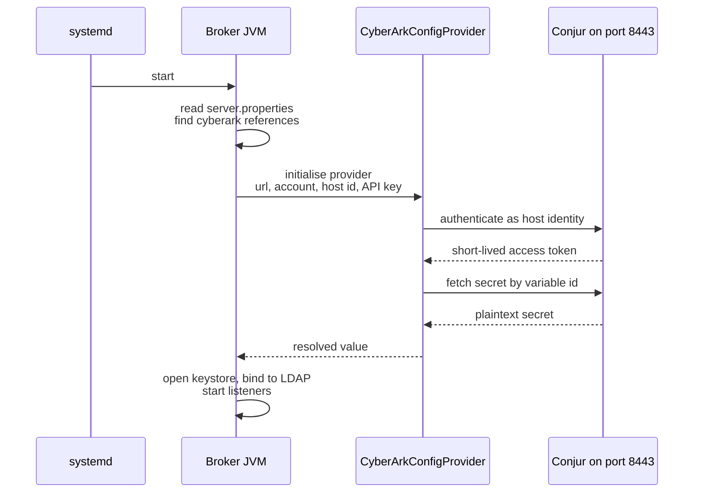

# Secret Externalization with CyberArk Conjur

Keeps passwords off the target machines entirely. The broker and Schema
Registry authenticate to Conjur at startup and pull their secrets directly from
the vault.

**Prerequisite:** the base installation from the main README must be complete
and the cluster running.

> You do not have to apply FileConfigProvider first, but it is recommended:
> validating the reference structure in a simpler setting and then swapping
> only the provider is easier than testing two variables at once.

> **Paths assume `installation_method: archive`** — configuration lives under
> `/opt/confluent/etc/` and the bundled JARs under
> `/opt/confluent/confluent-8.3.0/share/java/`. On an RPM install substitute
> `/etc/` and `/usr/share/java/`.

---

## How it works

```properties
ssl.keystore.password=${cyberark:cp-node1/keystore-password:cp-node1/keystore-password}
```

At startup the broker authenticates to Conjur with a **host identity**
(`host/cp-node1` plus an API key), receives a short-lived token, and fetches
the secret. The only credential stored on the machine is the API key; the
passwords themselves are never written down.



The API key is read **raw**, before the ConfigTransformer engages — which is
why it cannot itself be a `${...}` reference (see step 6).

The policy ensures each host can read **only its own** secrets — compromising
one node does not expose the others' passwords.

---

## Step 1 — Bring up Conjur

The Conjur containers live in the shared compose stack, under the `conjur`
profile — see [`../../compose/`](../../compose/).

On `cp_infra_host`:

```bash
cd /opt/confluent-platform-lab/compose
cp .env.example .env      # if you have not already
podman run --rm docker.io/cyberark/conjur data-key generate
# put the output in CONJUR_DATA_KEY in .env, and set CONJUR_DB_PASSWORD too
```

TLS certificate for the nginx proxy:

```bash
mkdir -p tls
openssl req -x509 -newkey rsa:2048 -nodes -days 825 \
  -keyout tls/conjur.key -out tls/conjur.crt \
  -subj "/CN=cp-node1" -addext "subjectAltName=DNS:cp-node1"
```

Start it alongside whatever else you are already running:

```bash
podman-compose --profile ldap --profile conjur up -d
podman ps --filter name=conjur          # four containers should be Up
```

## Step 2 — Account and policy

```bash
podman exec conjur-server conjurctl account create cplab
```

> **Save the admin API key** printed here — it is never shown again. Losing it
> means recreating the account.

```bash
podman exec conjur-client conjur init -u https://conjur-proxy -a cplab --self-signed
podman exec conjur-client conjur login -i admin -p "<ADMIN_API_KEY>"

podman cp policy/kafka-secrets.yml conjur-client:/tmp/
podman exec conjur-client conjur policy load -b root -f /tmp/kafka-secrets.yml
podman exec conjur-client conjur list
```

> The host names in `policy/kafka-secrets.yml` must match the
> `inventory_hostname` values in `hosts.yml` **exactly** — the broker
> authenticates as `host/{{ inventory_hostname }}`.

## Step 3 — API keys and secret values

Generate an API key per host and record it in `ansible/vault.yml`:

```bash
for N in cp-node1 cp-node2 cp-node3; do
  echo -n "$N: "
  podman exec conjur-client conjur host rotate-api-key -i "host/$N"
done
podman exec conjur-client conjur host rotate-api-key -i host/svc-kafka-schemaregistry
```

Populate the secret values:

```bash
for N in cp-node1 cp-node2 cp-node3; do
  podman exec conjur-client conjur variable set -i "$N/keystore-password"   -v confluentkeystorestorepass
  podman exec conjur-client conjur variable set -i "$N/truststore-password" -v confluenttruststorepass
  podman exec conjur-client conjur variable set -i "$N/ldap-bind-password"  -v '<LDAP_BIND_PASSWORD>'
done

podman exec conjur-client conjur variable set -i svc-kafka-schemaregistry/keystore-password   -v confluentkeystorestorepass
podman exec conjur-client conjur variable set -i svc-kafka-schemaregistry/truststore-password -v confluenttruststorepass
podman exec conjur-client conjur variable set -i svc-kafka-schemaregistry/kafkastore-password -v '<SR_LDAP_PASSWORD>'
```

**Verify** — an unset value breaks the deployment silently:

```bash
podman exec conjur-client conjur variable get -i cp-node1/keystore-password
```

You should see the value. `CONJ00076E ... empty or not found` means it was
never set.

> **The `keystore-password` value is fixed.** cp-ansible builds the keystores
> with its own default password (`confluentkeystorestorepass`); the value in
> Conjur must match it exactly.
>
> **Store secrets as plain text**, not JSON. The provider reads the value
> verbatim.

## Step 4 — Surviving reboots

**Do not skip this.** If Conjur is down, the brokers cannot resolve their
passwords and will not start; an RBAC-enabled KRaft controller then cannot
initialise its own authorizer because the co-located broker never comes up, and
after `confluent.authorizer.init.timeout.ms` (default 10 minutes) it fails too.
The symptom looks like "the controller crashed" while the cause is Conjur.

```bash
for c in conjur-database conjur-server conjur-proxy conjur-client; do
  podman update --restart=always $c
done
sudo systemctl enable --now podman-restart.service
podman inspect conjur-server --format '{{.HostConfig.RestartPolicy.Name}}'   # always
```

> `podman update --restart=always` alone is **not sufficient**. Podman has no
> persistent daemon like Docker's; for the policy to take effect across a real
> host reboot, the `podman-restart.service` unit must also be enabled.

> **Persistence:** the compose stack attaches a named volume
> (`conjur-db-data`) to the database, so a plain `down` no longer destroys
> your secrets — an improvement over the upstream quickstart, which runs it
> with no volume at all. **`down -v` still wipes it**, because that flag
> removes volumes; if that happens you must repeat from step 2.

## Step 5 — Provider JARs

The Conjur ConfigProvider does not ship with Kafka; it must be installed
separately. Download and extract the Confluent CSID CyberArk provider package,
then:

```bash
cd /opt/confluent-platform-lab/ansible
ansible-playbook -i hosts.yml ../secrets/cyberark-conjur/copy-cyberark-jars.yml \
  -e "provider_lib_dir=/opt/cyberark-provider/confluentinc-csid-secrets-provider-cyberark-<version>/lib"
```

> **The actual JARs are not at the archive root but one level down, under
> `lib/`.** Point at the wrong directory and the copy silently matches nothing
> — you only find out when the service fails to start with
> `ClassNotFoundException: ...CyberArkConfigProvider`. The playbook catches
> this up front.

## Step 6 — Add the blocks to the inventory

Add to the top of the **`kafka_broker_custom_properties`** block in
`ansible/hosts.yml`:

```yaml
      config.providers: cyberark
      config.providers.cyberark.class: io.confluent.csid.config.provider.cyberark.CyberArkConfigProvider
      config.providers.cyberark.param.cyberark.url: "https://{{ cp_infra_host }}:8443"
      config.providers.cyberark.param.cyberark.account: cplab
      config.providers.cyberark.param.cyberark.auth.username: "host/{{ inventory_hostname }}"
      config.providers.cyberark.param.cyberark.auth.apikey: "{{ conjur_host_apikeys[inventory_hostname] }}"
      config.providers.cyberark.param.cyberark.ssl.verify.enabled: false
      ssl.key.password: "${cyberark:{{ inventory_hostname }}/keystore-password:{{ inventory_hostname }}/keystore-password}"
      ssl.keystore.password: "${cyberark:{{ inventory_hostname }}/keystore-password:{{ inventory_hostname }}/keystore-password}"
      ssl.truststore.password: "${cyberark:{{ inventory_hostname }}/truststore-password:{{ inventory_hostname }}/truststore-password}"
      # ... (full list in hosts-overlay.yml)
```

And replace the `ldap.java.naming.security.credentials` line:

```yaml
      ldap.java.naming.security.credentials: "${cyberark:{{ inventory_hostname }}/ldap-bind-password:{{ inventory_hostname }}/ldap-bind-password}"
```

Full list plus the Schema Registry block: [`hosts-overlay.yml`](hosts-overlay.yml)

**Add to `vault.yml`:**

```yaml
conjur_host_apikeys:
  cp-node1: "<API_KEY>"
  cp-node2: "<API_KEY>"
  cp-node3: "<API_KEY>"
vault_schemaregistry_conjur_apikey: "<API_KEY>"
```

> **`auth.apikey` cannot contain another ConfigProvider reference.** Provider
> bootstrap parameters are read raw, **before** the ConfigTransformer engages.
> Writing `${file:...}` or `${cyberark:...}` there simply will not resolve —
> which is why it comes from the vault as a literal.

> `ssl.verify.enabled: false` is for labs only. In production set it to `true`
> and add the Conjur CA to the broker truststore.

## Step 7 — Redeploy and verify

```bash
cd /opt/confluent-platform-lab/ansible
ansible-playbook -i hosts.yml -e @vault.yml confluent.platform.all
```

No plaintext passwords should remain:

```bash
ansible kafka_broker -i hosts.yml -b -m shell -a \
  'grep -iE "password=|credentials=" /opt/confluent/etc/kafka/server.properties | grep -v "\${cyberark:" | wc -l'
```

Services and TLS:

```bash
ansible all -i hosts.yml -b -m shell -a \
  'systemctl is-active confluent-server confluent-schema-registry'
openssl s_client -connect cp-node1:9092 -CAfile ../pki/ca/ca.crt </dev/null 2>&1 \
  | grep "Verify return code"
```

---

## Troubleshooting

**`ClassNotFoundException: ...CyberArkConfigProvider`** — the JARs were not
copied. See the `lib/` subdirectory warning in step 5.

```bash
ls /opt/confluent/confluent-8.3.0/share/java/kafka/ | grep -i cyberark | wc -l    # 0 means not copied
```

**`'conjur_host_apikeys' is undefined`** — missing from `vault.yml`. This error
may appear as `censored` because of `no_log: true`; to see the real text:

```bash
ansible-playbook ... -e mask_secrets=false
```

**Service starts but the password is wrong** — check the key part of the
reference. In `${cyberark:<path>:<key>}` both halves must be written
identically.

**Cluster will not start after a reboot** — check Conjur first:

```bash
podman ps -a --filter name=conjur
podman start conjur-database conjur-server conjur-proxy conjur-client
```

If the containers were merely **stopped** (not removed), `podman start` brings
them back with no data loss. Then restart the broker and controller services.

---

## Extending

Kafka Connect, REST Proxy, Control Center and the KRaft controller are out of
scope. The pattern is identical:

1. Add `- !host svc-<component>` plus variables and permits to `policy/kafka-secrets.yml`
2. Populate the values with `conjur variable set`
3. Copy the provider JARs into the component's lib directory
4. Write the provider block and references into `<component>_custom_properties`

**For the controller:** it uses its own configuration file
(`/etc/controller/server.properties`), not the broker's.
